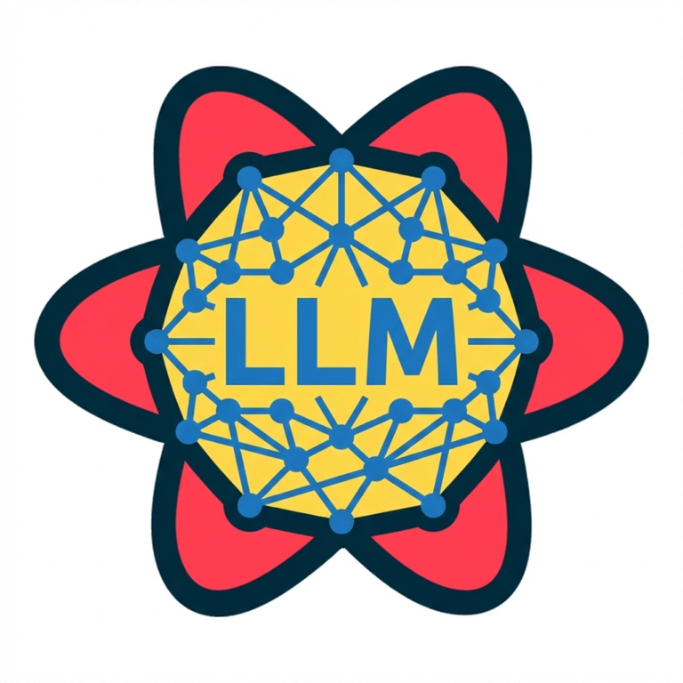

<p align="center">
  
</p>

# tanstack-query-llms-txt

English version: [README.md](README.md)

이 프로젝트는 TanStack Query React 문서(`docs/framework/react`)를 읽어 저장소 루트에 `llms.txt`를 생성합니다.  
생성된 파일은 GitHub Actions로 자동 갱신됩니다.

## 개요

| 항목 | 값 |
| --- | --- |
| 소스 문서 | `TanStack/query/docs/framework/react` |
| 생성 파일 | `llms.txt` (저장소 루트) |
| 실행 스케줄 | 매일 **오전 9시(KST)** (`00:00 UTC`) |

## 실행 스케줄

- 매일 **오전 9시(KST)** 에 실행됩니다 (`00:00 UTC`).

## 동작 방식

1. `scripts/generate-llms.mjs`가 GitHub에서 문서 트리를 조회합니다.
2. Markdown 파일(`.md`, `.mdx`)을 수집해 `llms.txt`를 생성합니다.
3. `.github/workflows/generate-llms.yml`이 스케줄 또는 수동 실행되며, 변경 시 `llms.txt`를 커밋합니다.

## 생성 파일 위치

- 레포지토리: `https://github.com/heyman333/tanstack-query-llms-txt`
- 브랜치: `main`
- 파일: `llms.txt` (저장소 루트)

`Generate llms.txt` 액션이 성공하면 `main` 루트에 `llms.txt`가 커밋됩니다.

## 로컬 실행

```bash
npm run generate:llms
```

생성 결과:

- `llms.txt` (저장소 루트)
